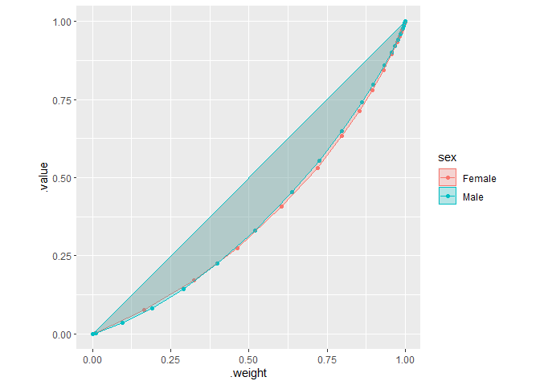

<!-- README.md is generated from README.Rmd. Please edit that file -->

# ineqr

<!-- badges: start -->
<!-- badges: end -->

ineqr measures inequalities such as the Gini coefficient and plots
Lorenz curves from (grouped) data frames.

## Installation

You can install the development version of ineqr from
[GitHub](https://github.com/) with:

``` r
# install.packages("devtools")
devtools::install_github("UchidaMizuki/ineqr")
```

## Example

This is a basic example which shows you how to solve a common problem:

``` r
library(ineqr)
library(tidyverse)

# Survey of Labour and Income Dynamics
SLID <- carData::SLID |>
  as_tibble() |>
  filter(!is.na(wages))

SLID_agg <- SLID |>
  mutate(wageclass = cut(wages, 20)) |>
  group_by(sex, wageclass) |>
  summarise(wages = mean(wages),
            pop = n(),
            .groups = "drop")

SLID
#> # A tibble: 4,147 × 5
#>    wages education   age sex    language
#>    <dbl>     <dbl> <int> <fct>  <fct>   
#>  1 10.6       15      40 Male   English 
#>  2 11         13.2    19 Male   English 
#>  3 17.8       14      46 Male   Other   
#>  4 14         16      50 Female English 
#>  5  8.2       15      31 Male   English 
#>  6 17.0       13.5    30 Female English 
#>  7  6.7       12      61 Female English 
#>  8 14         14      46 Female Other   
#>  9 19.2       18      43 Male   English 
#> 10  7.25      11      17 Male   English 
#> # … with 4,137 more rows
SLID_agg
#> # A tibble: 40 × 4
#>    sex    wageclass   wages   pop
#>    <fct>  <fct>       <dbl> <int>
#>  1 Female (2.25,4.68]  3.66    17
#>  2 Female (4.68,7.06]  6.58   328
#>  3 Female (7.06,9.44]  8.15   331
#>  4 Female (9.44,11.8] 10.5    286
#>  5 Female (11.8,14.2] 12.9    296
#>  6 Female (14.2,16.6] 15.3    235
#>  7 Female (16.6,19]   17.7    165
#>  8 Female (19,21.3]   20.1    114
#>  9 Female (21.3,23.7] 22.6     85
#> 10 Female (23.7,26.1] 25.0     76
#> # … with 30 more rows
```

``` r
SLID |>
  inequality(wages,
             index = c("gini", "theil"))
#> # A tibble: 2 × 3
#>   .index .inequality .cumulative         
#>   <chr>        <dbl> <list>              
#> 1 gini         0.276 <tibble [4,148 × 2]>
#> 2 theil        0.120 <tibble [4,148 × 2]>

# Measuring inequality by group
SLID |>
  group_by(sex) |> 
  inequality(wages,
             index = c("gini", "theil"))
#> # A tibble: 4 × 4
#>   sex    .index .inequality        .cumulative
#>   <fct>  <chr>        <dbl> <list<tibble[,2]>>
#> 1 Female gini         0.273        [2,078 × 2]
#> 2 Female theil        0.118        [2,078 × 2]
#> 3 Male   gini         0.265        [2,071 × 2]
#> 4 Male   theil        0.112        [2,071 × 2]
```

``` r
# Measuring inequality using weights
inequality_bysex <- SLID_agg |>
  group_by(sex) |> 
  inequality(wages, 
             weight = pop,
             index = c("gini", "theil"))

inequality_bysex
#> # A tibble: 4 × 4
#>   sex    .index .inequality        .cumulative
#>   <fct>  <chr>        <dbl> <list<tibble[,2]>>
#> 1 Female gini         0.270           [21 × 2]
#> 2 Female theil        0.117           [21 × 2]
#> 3 Male   gini         0.263           [21 × 2]
#> 4 Male   theil        0.111           [21 × 2]
```

``` r
# Plotting Lorenz Curves
autoplot(inequality_bysex) +
  geom_point() +
  geom_polygon(alpha = 0.25) +
  tune::coord_obs_pred()
```


